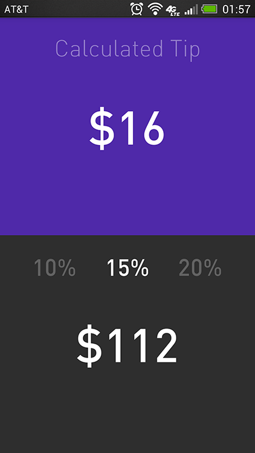

Tip Calculator
=============

Time spent: 2-4 hours

Completed user stories: 

 * [x] Required: User enters the total amount of the transaction
 * [x] Required: User can select between tip amounts (i.e 10%, 15%, 20%)
 * [x] Required: Upon selecting tip amount, formatted tip value is displayed
 * [x] (Optional) User changes the total amount and updated tip is reflected automatically
 * [] (Optional) User can select custom tip percentage if desired
 * [] (Optional) User can select how many ways to split the tip
 * [] (Optional) User can edit preset tip percentages and have them persist across launches
 * [] (Optional) Experiment with trying input widgets to replace the buttons and/or textviews
 * [x] (Optional) Improve the user interface and experience by using images and/or colors
 
 
 
 
 

https://github.com/thecodepath/android-rottentomatoes-demo/raw/submission/anim_rotten_tomatoes.gif
 
